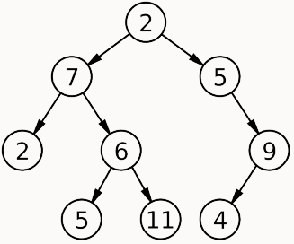

[Table of Contents](README.md)

# Trees

## Research and Discussion:

>A tree data structure can be defined recursively as a collection of nodes (starting at a root node), where each node is a data structure consisting of a value, together with a list of references to nodes (the "children"), with the constraints that no reference is duplicated, and none points to the root.
>
> Wikipedia

Essentially, trees are a data structure that emulate the structure of a real-world tree. There's a root, which is where the tree starts. From the root, the structure "grows" and branches out. The nodes that are branched off of the root are called "children" nodes. These nodes can in turn have their own children. This branching will continue until a node no longer has children. This last node is called a "leaf." As with a real tree, if the series of children nodes make up the branches, the leaves are at the ends of the branches. Each connection from parent to child is called an "edge." The total height of a tree is the total number of edges from the root to the furthest down leaf node. While the structure is typically depicted with the root at the top, it still can easily be concepualized in the form of a real tree. Roots in the ground, the trunk and branches growning from that, giving it height, and then leaves at the ends of the branches. 

Now that we have an idea of what the structure of a tree looks like, we can begin to tackle what a tree might be used for and how we interact with it. First, a tree has no built in methods like stacks and queues do. And traveral of a tree is typically done using recursion as opposed to a while loop. That being said, there are a few standard thigns that are done with and to a tree depending on the type of tree it is. Specifically, we'll talk about binary trees and binary search trees.

Binary trees, as one might infer from their name, have only two branches. From the root, there will only ever be two children. Each child will only ever have two children. Each child will only ever have two leaves. This way, when either traversing or adding to/removing from a tree, we can know that we will only have to deal with `root.right` and `root.left`. A standard binary tree is not, by nature, set in any specific order.

A binary search tree (BST), on the other hand, is sorted in a specific way. In a BST, nodes are sorted with `node.left` being `< less than` and `node.right` being `> greater than` the root or 'current' node. So lets say we have a BST with a root node of 20. The next node to be added will be sorted depending on whether it is a larger or smaller number than 20. This new node will be the left or right child depending on if it is smaller or larger, respectively. Meaning, if 20 is the root and the new node to be added is 15, we would set 15 as `root.left`. And the tree will continue to be sorted in this way until there are no new nodes to add.

Here we have a standard, unsorted binary tree:

And this is what a binary search tree looks like:

Notice the way the BST is ordered using the `left = <`/`right = >` approach!

## Vocabulary:

* `Node` - The individual item/data that makes up each piece of the data structure.
* `Root` - The first node or the `top` of the tree.
* `Left Child` - The node that is positioned to the left of a root or current node.
* `Right Child` - The node that is positioned to the right of a root or current node.
* `Edge` - The edge in a tree is the link between a parent and child node.
* `Leaf` - A leaf is a node that doesn't contain any children. The "bottom" of one of the "branches" of the tree.
* `Height` - The height of a tree is determined by the number of edges from the root to the bottom most node.

## Additional Resources:

* Article: [Trees](https://codefellows.github.io/common_curriculum/data_structures_and_algorithms/Code_401/class-15/resources/Trees.html)
* Wikipedia: [Tree (data structure)](https://en.wikipedia.org/wiki/Tree_(data_structure)#:~:text=A%20tree%20data%20structure%20can,none%20points%20to%20the%20root.)