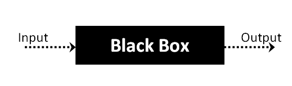

[Table of Contents](README.md)

# React: Props and State

## Review, Research and Discussion:

1. Does a deployed React application require a server?

    It depends on how you want the app to be deployed. There seem to be two general options.
    1. If all you are looking for is to be on the web, a React app can be deployed as a static website using AWS S3. S3 acts as a "bucket" that can hold all of the HTML, JS and CSS files used in a website. From this bucket, these files can then be served directly as a static website. A single bucket is a single webpage. 
    2. If you want a more advanced, dynamic web application then you'll probably want to serve the React app from a server like an express server. Using an express server will allow you to set up specific routes like with an API and have more functionality. 

2. Why do we prefer to test a React application at the behavior rather than the unit level?

    Unit testing is simply saying, `expect A to be A`. Unit testing is very handy and widely used on a daily basis. It tests each individual component of an application and asserts that it does what it is supposed to do. Unit tests are aimed at testing the inner workings of a specific piece of an application such as a function, a class etc.
    
    Alternatively, behavioral testing, also referred to as Black Box testing, focuses on the input and output of an application. Behavioral testing does not need to know or even care about the inner workings of an application. These tests are only focused on if the input that went in properly corresponds to the output generated.

    

    As a tester, you are not concerned with what is in the black box. If input goes in, is the output what it expected?

    This being the case, I would think that the reason that it's prefered to test React application at the behavior level rather than the unit level is because, since React is used to build front-end aplications, we are more concerned that the input/output is what we want and expect it to be. If we have a web application built with React, our primart concern is that the end user is able to send and recieve the appropriate data. While unit tests will assert that the button does in fact submit the form data, we are more concerned with the user experience. Still, I would say that a properly tested application would employ both styles to ensure that each piece works and also ensure that the user's input/output is what is expected.

3. What does `npm run build` do?

    Running the command `npm run build` inside of a React application will create a `build` directory that has a production build of your application. During the development of a React app, it is normal to have separate files for both the JavaScript and the CSS. Having all of the code in its own modular files and folders makes it easier for us as devopers to keep track of everythng. But once the application is ready to be deployed, having everything in its own separate file might make the deployed app run slower since it will have to make an HTTP request for each individual resource. Runnig `npm run build` will effectively bundle up all of these individual files, reducing load on the browser and increasing end user performance. 

4. Describe the actual composition / architecture of a React application

    A React application, in very broad terms, is a colletion of components wrapped inside of one primary component. To expand, a React application has an `index` that is the main entry to the application. The `index` is what imports in the `App` component, which is the primary parent container that holds everything else. This component is a class that has a `render` method. This render method will "call" the other components, rendering them to the browser in the order they are listed inside `App`. The other components could be things like header, footer and nav that all have their own individual logic to do what those components need. These components are inported to the `app.js` file, called inside `App` and then rendered to the page. 

## Vocabulary:

* `BDD` - Behavior Driven Developemnt. This is a process that takes ideas from TDD and adds in collaboration with management and non-technical members of a product team to give a generalized idea of what exactly an application should be doing. Unlike TDD, this concept focuses more on application from a more holistoc view and seeks to ensure that the behavior of an application or product is what the team as a whole expects it to do.
* `Acceptance Tests` - Acceptance tests are generally high level tests used to ensure that an application or piece of software has met the business requirements of the product. Typically not something done in the beginning stages of development, acceptance tests are implemented once a procuct has reached a point where talks of depployment are being held.
* `mounting` - In relation to React, this refers to when a component is being added to the the DOM.
* `build` - Once you are ready to see about deploying a React application, you will create a new build of the app. A build is all of the files, bundled up nicely, minimized as much as possible to reduce the load on the browser so that the user has a streamlined use experience.

## Preview: 

1. Which are some things had you heard about previously and now have better clarity on?

    1. Props. I had seen the word used in various places but wasn't entirely sure how it was used. Now I understand that props refers to the properties of a component, which come from when the component is initially created. To pass these props down to a child to use, just add them into the child's constructor using `super`.
    2. State. While I still and not 100% on state, I much better understand it now. State is simply an object that contains all of the data for a component. State can be shared with a components children, but as with other data types in JS, scope needs to be considered when trying to view or modify state.

2. Which are some things are you hoping to learn more about in the upcoming lecture/demo?

    1. I would like to see more about how state is transfered to/from child components and how parent state is accessed/modified from within a child.

3. What are you most excited about trying to implement or see how it works?

    1. I want to play around with props and see what all can be done within these.
    2. I'm interested to see how different React testing will be compared to the tests we were writing in node.

## Additional Resources:

* Article: [How to deploy a React application: An in-depth overview](https://codebrahma.com/deploy-react-application-depth-overview-various-options-deploy/#:~:text=Once%20you%20build%20your%20files,facility%20to%20host%20the%20server.)
* Article: [What is BLACK Box Testing? Techniques, Example & Types](https://www.guru99.com/black-box-testing.html)
* Documentation: [Create React App: Deployment](https://create-react-app.dev/docs/deployment/)
* Wikipedia [Behavior-driven development](https://en.wikipedia.org/wiki/Behavior-driven_development)
* Documentation: [Create React App: Creating a Production Build](https://create-react-app.dev/docs/production-build/)